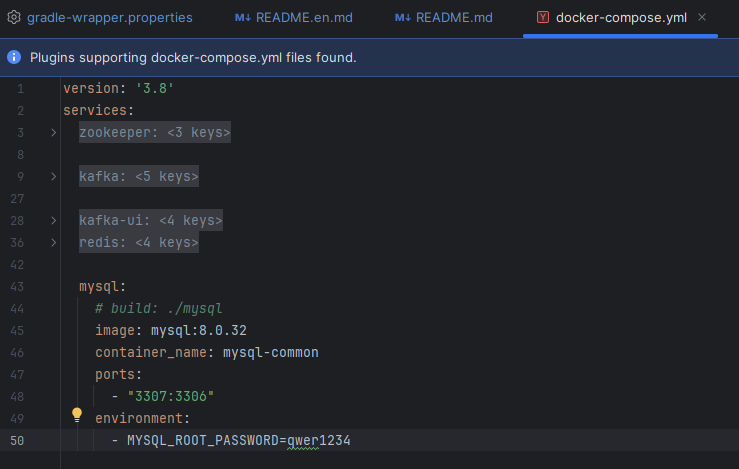
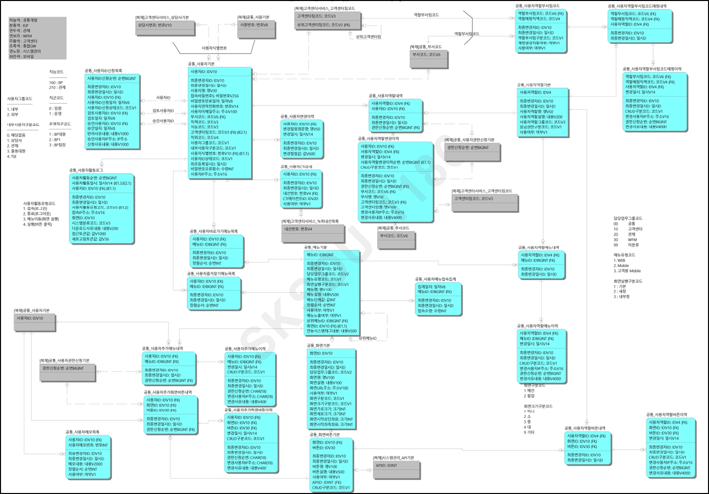

# RA-JAVA-FRAMEWORK-COMMON

## 소개

이 프로젝트는 공통 관리, 계정 관리에 대한 다음 기능을 포함하고 있습니다.

**공통 서비스**  
- 메뉴 관리  
  - 트리 구조 기반의 메뉴 관리와 기본 메뉴 설정 제공  
  - main/popup으로 분류된 화면 정보를 관리하고, 화면을 버튼과 매핑  
- API 관리  
  - 시스템 호출 API 기본 정보 관리  
  - 호출된 API의 사용 이력 관리  
- 기타:  
  - 코드 관리 / 파일 관리 / 암호화, 복호화 / 마스킹  

**계정 서비스**  
- 인증  
  - JWT 방식을 이용한 인증  
  - Access Token(AT), Refresh Token(RT)의 타임아웃 기능을 포함하여 보안을 강화  
  - Frontend, API Gateway, Account Service 간 자동 AT 갱신을 통해 사용자 경험 개선  
  - SSO 통합 로그인 기능 지원  
- 계정 관리  
  - 시스템 사용을 위한 계정 생성 및 신청 프로세스 자동화  
  - 사용자 계정 라이프사이클 관리  
- 권한(접근제어)  
  - 역할 기반 권한 관리  
  - 역할 외 사용자에 대한 메뉴/버튼 매핑을 통한 개별 권한 관리  
  - 버튼-API 매핑을 통한 API 단위 권한 관리  
- 이력관리
  - 보안 표준 충족을 위한 이력 관리  
  - 사용자 계정 정보 변경 및 권한 매핑 내역 추적  
  - 로그인/로그아웃, 화면 실행, 개인정보 다운로드 등의 사용자 활동 로깅  
  - sqltrace를 통해 백엔드에서 호출되는 쿼리 이력 저장  

## 사전 준비 사항

- JDK 17 이상  
- Lombok  
- Docker 및 Docker Compose  
- Gradle 8.3 (또는 포함된 Gradle 래퍼 사용)  

## 프로젝트 구조

이 프로젝트는 다음 모듈들로 구성되어 있습니다:

- `common-service` - 메인 서비스 구현체  
- `common-export` - 공통 유틸리티와 공유 컴포넌트  
- `account-service` - 메인 서비스 구현체  
- `account-export` - 공유 DTO와 인터페이스  

## 설치 및 설정

1. 저장소를 클론합니다:

```bash
git clone <repository-url>
cd common
```

2. Docker Compose로 필요한 서비스를 실행합니다:

```bash
# zookeeper, kafka, kafka-ui, redis, mysql 서비스 시작
docker-compose -f docker-compose.yml up -d
```

3. KeyCloak을 시작합니다:

```bash
# Keycloak 시작
docker-compose -f docker-compose-keycloak.yml up -d
```

4. 데이터베이스를 초기화합니다:

> [!NOTE]  
> mysql 대신 H2 데이터베이스를 사용하려면, docker-compose.yml 파일에서 MySQL 서비스를 주석 처리하세요.  
> 이후에는 본 단계를 건너뛰고 "Running the Application with H2 Database" 섹션으로 이동하세요.  
>
> 

```bash
# 실행 중인 컨테이너 목록 확인
  docker ps

# mysql 컨테이너 접속
  docker exec -it mysql-common bash

# mysql 로그인
mysql -u root -p

# 터미널에 MySql 비밀번호(qwer1234) 입력

# SQL 파일 실행
# 데이터베이스 생성
CREATE DATABASE OCO;

# 계정 생성
CREATE USER 'com_dev'@'%' IDENTIFIED BY 'qwer1234!';

# 권한 부여
GRANT ALL PRIVILEGES ON OCO.* TO 'com_dev'@'%';

FLUSH PRIVILEGES;
```

5. IDE로 접속하기

MySQL Workbench 같은 툴 또는 다른 IDE에서 mysql 컨테이너에 접속할 수 있습니다. 설정 절차는 다음과 같습니다:

- MySQL Workbench 또는 사용하려는 IDE를 엽니다.  
- 아래 정보를 입력하여 새로운 연결을 설정합니다:  
  - **Hostname**: 127.0.0.1 (localhost)  
  - **Port**: 3307  
  - **Database**: OCO  
  - **Username**: root  
  - **Password**: qwer1234!  
- Test Connection: MySQL 서버에 접근이 가능한지 확인합니다.  
  필요하다면 'allowPublicKeyRetrieval=true' 설정을 적용해야 할 수도 있습니다.

연결 성공 후에는 IDE의 그래픽 인터페이스를 통해 데이터베이스 관리, SQL 쿼리 수행, 데이터 조작 등이 가능합니다.

스키마와 사용자 초기화가 끝난 뒤, README와 같은 폴더에 있는 2개 sql 파일(`query.sql`, `oif_query.sql`, `menu.sql`)을 순서대로 실행해야 합니다.

먼저 `query.sql` 파일의 스크립트를 실행해 테이블을 생성합니다.  
다음으로 `oif_query.sql` 파일의 스크립트 실행  
마지막으로 `menu.sql` 파일을 실행해 메뉴 구성 샘플 데이터를 추가합니다.

6. 프로젝트 빌드:

```bash
./gradlew clean build
```

> [!NOTE]
>
> 만약 `./gradlew: Permission denied` 오류가 발생한다면, 아래 명령어 중 하나를 실행한 뒤
>
>    -``sudo chmod +x ./gradlew``
>    
>    -``git update-index --chmod=+x gradlew``
>
> 다시 2단계(프로젝트 빌드)를 진행해 보세요.

7. swagger 활성화:

application.yml에서 아래 `enabled: false` 라인을 주석 처리하거나 `enabled: true`로 변경합니다 (개발 환경에서만 권장).

```code
springdoc:
  api-docs:
    ...
    enabled: false
  swagger-ui:
    ...
    enabled: false
```

## 애플리케이션 실행

1. Common Service 시작:

```bash
./gradlew :common-service:bootRun
```

2. Account Service 시작:

```bash
./gradlew :account-service:bootRun
```

> [!NOTE]  
> IntelliJ, Eclipse 같은 IDE에서 직접 실행할 수도 있습니다. 만약 프로젝트 시작 시 에러가 발생한다면, 아래 항목을 확인하세요:  
> - JDK 버전  
> - Gradle 설정  
> - 프록시 확인  
> - 프로젝트 내부의 `.gradle` 폴더 제거 후, 2단계(프로젝트 빌드) 재실행  

3. Swagger Common API는 `http://localhost:9100/api/com/common/swagger-ui/index.html` 에서 확인 가능합니다.  
   

4. Swagger Account API는 `http://localhost:9101/api/com/account/swagger-ui/index.html` 에서 확인 가능합니다.  
   

## H2 데이터베이스로 애플리케이션 실행

1. Common Service 시작:

```bash
./gradlew :common-service:bootRun -Pprofile=test
```

2. Account Service 시작:

```bash
./gradlew :account-service:bootRun -Pprofile=test
```

3. H2 콘솔 `http://localhost:9100/api/h2-console`  
- H2 콘솔 접속 설정:  
  - **Saved Settings**: Generic H2 (Embedded)  
  - **Setting Name**: Generic H2 (Embedded)  
  - **Driver Class**: org.h2.Driver  
  - **JDBC URL**: jdbc:h2:mem:common  
  - **User Name**: sa  
  - **Password**:  
  - 

## 개발

- 모든 모듈을 빌드하려면 `./gradlew build`  
- 테스트를 실행하려면 `./gradlew test`  
- 로컬에서 서비스를 실행하려면 `./gradlew bootRun`  

## 데이터베이스 설정

프로젝트는 초기 설정을 위한 SQL 스크립트를 포함합니다:

- `query.sql` - 데이터베이스 덤프  
- `oif_query.sql` - 데이터베이스 덤프  
- `menu.sql` - 메뉴 관련 데이터  

논리 ERD  


물리 ERD  


## 관련 저장소

- [ra-java-framework-work-batch](https://github.com/skccmygit/ra-java-framework-work-batch) API 로그/계정 권한 관련 배치  
- [ra-java-api-gateway](https://github.com/skccmygit/ra-java-api-gateway) API 게이트웨이  

## erd.json 파일 사용 안내
1. 파일 위치
```
    docs/
        ├── db/
        │   └── schema_*.erd.json
```

2. `ERD Editor` 확장 기능 설치
- VS Code에서:
  - 왼쪽 사이드바의 **Extensions** 아이콘 클릭
  - “ERD Editor” 검색
  - **Install** 버튼 클릭

3. `schema_*.erd.json` 파일 열기
- VS Code 탐색기에서 `schema_*.erd.json`을 클릭 후, ERD Editor 확장 기능이 다이어그램을 렌더링할 때까지 잠시 대기
- 엔티티와 관계를 시각화하거나 편집 가능

## 테스트 API 사용 안내
> [!NOTE]
> 이 프로젝트에는 테스트용 샘플 데이터를 설정하기 위한 SQL 스크립트가 포함되어 있습니다.
> 아래에 설명된 디렉터리에 있는 스크립트를 사용하여 데이터베이스에 해당 데이터를 임포트해 주세요.
```
docs/
    ├── test-api-instructions
    │   └── data-sample.sql
```

### API - Account Service

- API - 계정 정보 리스트 조회 - 조건별2
```
http://localhost:9101/api/v1/com/account/user/search?deptcdList=D001,D002&userNm=
```

```
http://localhost:9101/api/v1/com/account/user/search?deptcdList=D003&userNm=
```

### API - Common Service

- API - 메뉴 조회 - 화면 ID 기준
```
http://localhost:9100/api/v1/com/common/menu/screnId?screnId=COM-PM0002
```

- API - 메뉴 상세 조회 - 메뉴 ID 기준
```
http://localhost:9100/api/v1/com/common/menu/dtl?menuId=COM-01-05-02
```

## 추가 자료

- 각 모듈의 문서를 확인하여 세부 사항을 확인하세요.
- 인프라 설정은 docker-compose 파일을 참고하세요.

## 문제 해결

- DB 연결 문제가 발생하면, DB 컨테이너가 실행되고 있는지 확인하세요.
- IDE 콘솔에 출력된 에러 로그 또는 프로젝트 디렉터리에 생성된 로그 파일을 확인하세요.
